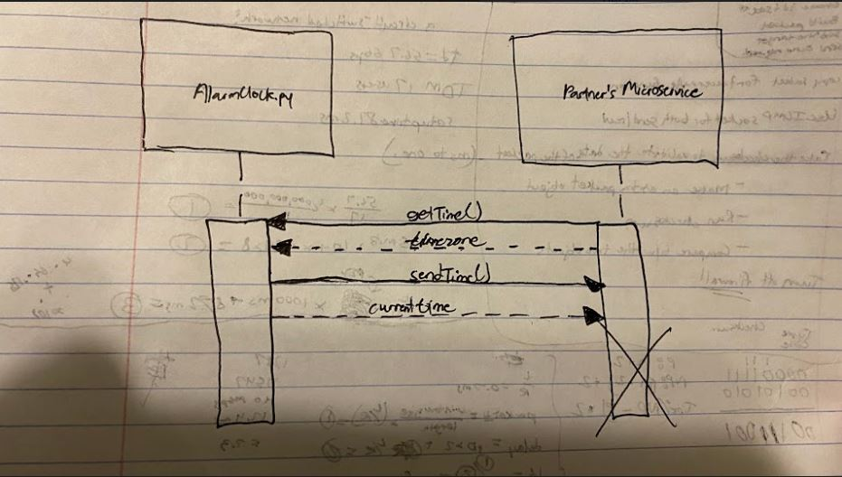

# Project AlarmClock.py

Project AlarmClock is a Tkinter application designed to set an alarm and play an audio cue when the alarm matches the time.

## User Stories

The following functionality is **completed**:

- [x] User can view the current time
- [x] User can set the alarm
- [x] User can cancel the alarm
- [x] User can toggle the current time in AM or PM
- [x] User can input a new location to convert the clock's timezone 
- [x] User can hear an audio cue play when the alarm goes off
- [x] User can set and play different audio
- [x] User can view a random image in a new window when the alarm goes off

## Requesting/Receiving Data
- [x] A request can be made to my microservice by calling a getTime() method in your program which opens a ZMQ socket connection and sends a request. Optionally, the request may also send data to my microservice during this open connection.
- [x] Data can be received from my microservice by clicking the "Send Time to Client" button in Project AlarmClock. This will be picking up the call in a sendTime() method to get the current time and send it back before closing the ZMQ socket connection.

## UML Diagram

